# Rishabh Vishwakarma

Machine Learning Engineer focused on building production-grade AI systems that deliver measurable business impact.

I specialize in designing end-to-end machine learning pipelines, optimizing models, and deploying scalable AI solutions. With a strong mathematical background, my work focuses on turning complex data into reliable, high-performance systems used in real-world applications.

---

## 🧠 About Me

* 🤖 Machine Learning Engineer with a background in Mathematics
* ⚙️ Experienced in building end-to-end ML pipelines from experimentation to deployment
* 📚 Strong interest in Generative AI, Retrieval Augmented Generation (RAG), and scalable AI systems
* 📊 Focused on translating data and models into impactful production solutions

---

## 💼 Professional Experience

### Software Engineer – Machine Learning & Data Science

**Growdea Technologies**
Apr 2025 – Present

* ⚙️ Architected and deployed production-grade ML/AI systems using advanced preprocessing, feature engineering, statistical validation, and hyperparameter optimization.
* 📈 Achieved **10–20% performance improvement** over baseline models.
* 🌐 Built scalable inference services using **Django and Flask APIs**, containerized with **Docker**.
* 🔎 Developed **Retrieval Augmented Generation (RAG)** pipelines using **FAISS-based semantic retrieval**.
* 🧩 Designed model explainability frameworks to improve transparency and trust in predictive systems.
* 🔄 Managed the **complete ML lifecycle**, from problem framing to deployment monitoring and optimization.

---

### Data Science Intern

**Froyo Technologies**
Aug 2024 – Jan 2025

* 📊 Built a **Streamlit-based analytics dashboard** adopted by more than 20 stakeholders.
* ⏱ Reduced manual reporting effort by **over 50%**.
* 📈 Improved business reporting turnaround time through automated data insights.

---

## 🛠 Technical Skills

### 🤖 Machine Learning & AI

* 🐍 [Python](https://www.python.org/)
* 🔢 [NumPy](https://numpy.org/)
* 🐼 [Pandas](https://pandas.pydata.org/)
* 📊 [Scikit-learn](https://scikit-learn.org/stable/)
* 🔥 [PyTorch](https://pytorch.org/)
* 🧠 [TensorFlow](https://www.tensorflow.org/)
* ⚡ [Keras](https://keras.io/)
* 🧬 [Graph Neural Networks](https://pytorch-geometric.readthedocs.io/)
* ✨ [Generative Models](https://deepmind.google/discover/blog/generative-models/)
* 🎯 [Reinforcement Learning](https://spinningup.openai.com/)
* 🔎 [Retrieval Augmented Generation (RAG)](https://ai.meta.com/blog/retrieval-augmented-generation-streamlining-the-creation-of-intelligent-natural-language-processing-models/)
* 📉 [Statistical Analysis & Hypothesis Testing](https://en.wikipedia.org/wiki/Statistical_hypothesis_testing)
* ⚡ [Optuna](https://optuna.org/)
* 🖥 [CUDA](https://developer.nvidia.com/cuda-zone)

### ⚙️ Systems & Deployment

* 🌐 [Django](https://www.djangoproject.com/)
* 🧪 [Flask](https://flask.palletsprojects.com/)
* 📦 [Docker](https://www.docker.com/)
* 🗄 [PostgreSQL](https://www.postgresql.org/)
* 🐧 [Linux](https://www.kernel.org/)
* 🔧 [Git](https://git-scm.com/)
* 🐙 [GitHub](https://github.com/)

---

## Skill Network

```mermaid
graph TD

%% Center Node
R((Rishabh Vishwakarma))

%% Top Cluster
ML[Machine Learning]
ML1[PyTorch]
ML2[TensorFlow]
ML3[Scikit-Learn]
ML4[Graph Neural Networks]

%% Left Cluster
DATA[Data Science]
D1[Pandas]
D2[NumPy]
D3[Statistics]
D4[Feature Engineering]

%% Right Cluster
SYS[Systems & Deployment]
S1[Django]
S2[Flask]
S3[Docker]
S4[Linux]
S5[PostgreSQL]

%% Bottom Cluster
GEN[Generative AI]
G1[Transformers]
G2[RAG Systems]
G3[FAISS]
G4[LLM Applications]

%% Connections
ML --- R
DATA --- R
SYS --- R
GEN --- R

ML --- ML1
ML --- ML2
ML --- ML3
ML --- ML4

DATA --- D1
DATA --- D2
DATA --- D3
DATA --- D4

SYS --- S1
SYS --- S2
SYS --- S3
SYS --- S4
SYS --- S5

GEN --- G1
GEN --- G2
GEN --- G3
GEN --- G4

%% Colors
style R fill:#1f2937,color:#ffffff,stroke:#000

style ML fill:#bbdefb,stroke:#1e88e5
style DATA fill:#c8e6c9,stroke:#43a047
style SYS fill:#e1bee7,stroke:#8e24aa
style GEN fill:#ffe0b2,stroke:#fb8c00
```

## 🎓 Education

**B.Sc. (Hons.) Mathematics**
Ranchi University — First Division

Relevant Coursework

* 📐 Probability
* 📊 Statistics
* 📏 Linear Algebra
* ➗ Calculus

---

## 📜 Certifications

**Machine Learning with Python — IBM**

---

## 🚀 Interests

* 🤖 Applied Machine Learning
* ✨ Generative AI Systems
* ⚙️ AI Infrastructure
* 📐 Mathematical Modeling
* 📈 Scalable ML Systems

---

## 🌐 Connect With Me

* 💼 LinkedIn: https://linkedin.com
* 🐙 GitHub: https://github.com
* ✉ Email: [rishabh@example.com](mailto:rishabh@example.com)
